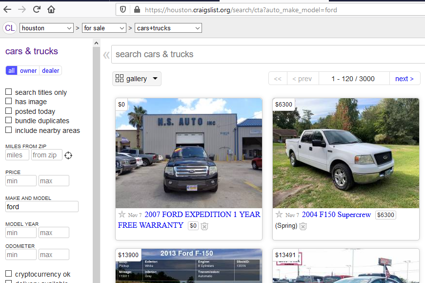

# tensorflow2
*tensorflow lessons*
***

### **[Shortcut to Weekly Notes Folder](https://github.com/jkmackie/tensorflow2/tree/master/notes)**

***
### <ins>Resources</ins>
* **[Notebooks](https://github.com/ageron/handson-ml2) for new <ins>[Hands-on Machine Learning with Scikit-Learn, Keras and TensorFlow 2](https://www.amazon.com/dp/1492032646/ref=cm_sw_r_tw_dp_U_x_HWDQDb0DEX69X)</ins>**
* **[TensorFlow Tutorials](https://www.tensorflow.org/tutorials/)**
* **[TensorFlow Serving with Docker](https://www.tensorflow.org/tfx/serving/docker)**

***
### <ins>Proposed learning</ins>
* **classify image**
* **extract name, address, payee, and amount from invoices**

***
### <ins>vehicle.json</ins>
* start_urls = [https://houston.craigslist.org/search/cta?auto_make_model=ford](https://houston.craigslist.org/search/cta?auto_make_model=ford)
* contains vehicle url, title, price, subLocation (Ex. Katy), attribute dictionary, and image dictionary
***
### start_url screenshot:

