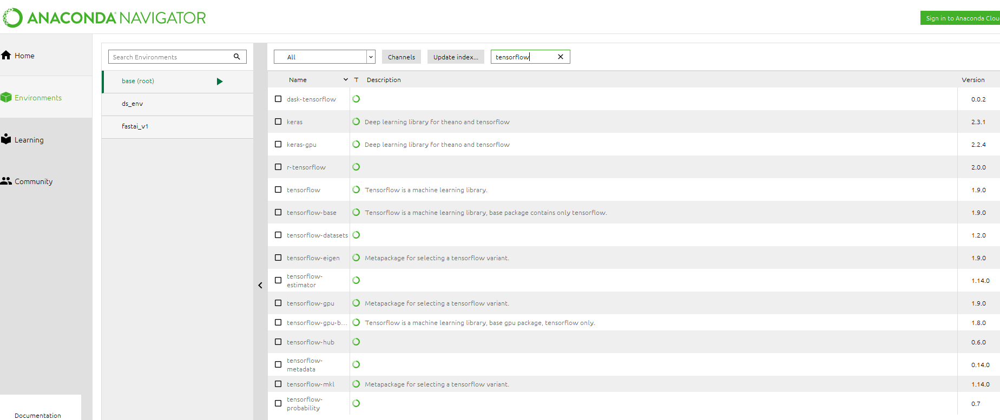

# tensorflow2
*tensorflow lessons*
*****
### Installation
* **should I use Windows10 with gpu, Ubuntu laptop without gpu, or cloud service?**
* **good setup for stable, commercial use?**
* **If using Windows, should I install tensorflow through Anaconda?**

#### <ins>Tensorflow-related modules in conda-forge</ins>

### Proposed learning
* **extract name, address, payor, and amount from invoices**

