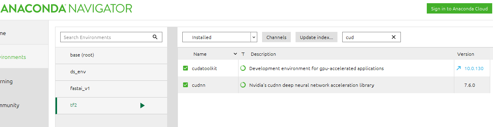

# tensorflow2
*tensorflow lessons*
*****
### <ins>Installation</ins>
* **Used Anaconda on Windows 10**
* **Did installation using both conda and pip installers**
* **New environment recommended as package compatibility could get broken.  Details in notebook.**
* **TF 2.0 installation: `pip install tensorflow-gpu`, *not* conda install**

#### <ins>Packages installed with conda</ins>

*****
### <ins>Proposed learning</ins>
* **classify image**
* **extract name, address, payee, and amount from invoices**

