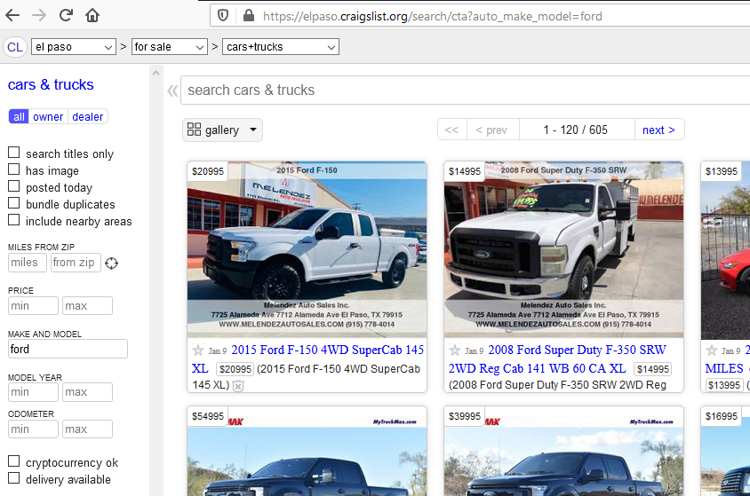

# car_price_prediction
*CraigsList vehicle price prediction with scikit-learn and pandas libraries.  Build a dataset from scratch, prepare it, engineer features, and evaluate predictions.*

**Presentation of car_price_prediction:**
[Auto Price Prediction from Scratch! Part 1: Overview](https://medium.com/analytics-vidhya/auto-price-prediction-from-scratch-part-1-overview-a4f331aaad00)

***
### start_url screenshot: 

  

---
## <ins>Project Notes</ins>

### Week 1 Notes
*Notes October 24 - October 30*

Car Price Prediction using Machine  Learning Techniques (Feb19) - ensemble provides much better predictions
* http://www.temjournal.com/content/81/TEMJournalFebruary2019_113_118.pdf

Build, Develop and Deploy a Machine Learning Model to predict cars price using Gradient Boosting (Mar19)
* https://towardsdatascience.com/build-develop-and-deploy-a-machine-learning-model-to-predict-cars-price-using-gradient-boosting-2d4d78fddf09
* https://github.com/PaacMaan/cars-price-predictor/blob/master/cars_price_predictor.ipynb

How to Build, Develop and Deploy a Machine Learning Model to predict cars price using Neural Networks (May19)
* https://medium.com/thelaunchpad/how-to-build-develop-and-deploy-a-machine-learning-model-to-predict-cars-price-using-neural-7f7439a37300

Scrapy spider tutorials:
* https://youtu.be/gGnGnIPgR84
  

---
### Week 2 Notes
*Notes October 31 - November 6*

**Scrape car price data from [Craigslist El Paso cars+trucks](https://elpaso.craigslist.org/d/cars-trucks/search/cta)**
* Get 50+ observations per model trim
* Organize the raw features in a database
* Clean the features so they are ready for modeling

**Scrape Filter Details**
* Filtered for dealer ('ctd') or owner ('cto') and make_model='ford'
* start_urls = ['https://elpaso.craigslist.org/search/cta?auto_make_model=ford']

---
### Week 3 Notes
*Notes November 7 - November 13*

* Changed data parsing tehnique from regex to string splitting
* Added LightGBM model
* Added numeric poly features and category pair features
* Brainstorming effecive ways to remove outliers.  Some promising techniques are here:  [5 Detection Techniques](https://towardsdatascience.com/5-ways-to-detect-outliers-that-every-data-scientist-should-know-python-code-70a54335a623)
* Trim spelling fix, None fix, and NaN fix was counterintuitive.  Fixing NaN only produced the best result!
* Certain prices are down payments.  $5,000 or less and "down" may be in the listing.

---
### Week 4 Notes
*Notes November 14 - November 20*
* Wrote script to download images for 7,300 vehicle listings.
* Built residuals visualization with bounds marking 3 standard deviations
* Improved invalid price identification by mining text for money "Down".
* Added VIN feature which revealed a large number of duplicates!  This caused data leakage because duplicates may fall in both train and test. Autos with matching Title/Odometer/Price we also flagged as duplicates.
* Data leakage in test **overstated** prediction performance because certain vehicles in train and test were the same vehicles (same features and price).  The unique listing, called vehicleID, was different.  However, the VIN for certain vehicles, was in many listings.

---
### Week 5 Notes
*Notes November 21 - November 27*
* Rebuilt Make/Model/Trim pipeline to better use regular expressions.
* Used regex to detect invalid "money down" prices
* Imputed missing odometer values with Year-Model median or Year median mileage.
* At the moment, using trims "as-is" works better than harmonizing spellings.  Need to investigate further.
* Transformed Odometer and Year features so correlation to Price improves.  Exponentiation improves left skew and log improves right skew.
* Added Isolation Forest to detect anomolies

---
### Week 6 Notes
*Notes November 21 - November 27*
* Dumped rare Trims - less than 50.  Also, dumped 'None' Trim which mainly helps the linear model.
* Improved residuals plots with error statistics and predicted vs true scatterplot
* Separated data preprocessing from model code
* Wrote outline of meetings and skills learned. Skills learned include residual analysis, scrapy website scraping, regex queries, isolation forest anomaly detection, downloading images with pillow using image dictionary, deserializing json list, advanced imputing of values using data dictionaries

---
### Week 7-8 Notes
*Notes November 28 - December 11*
* Stratified train and test by Model_Trim, rather than Trim alone.  Minimum 30+ Model_Trim count does decent predictions.
Imputing odometer by Year rather than Year-Model was reduced from 6 combos to 1.  But, no prediction benefit because all
combos are exclusive to train.
* Added KNN Regressor and MLP Regressor algorithms.
* Implemented both SQLite3 and PostgreSQL11 databases.
* Implemented FTP server vsftpd with security using LetsEncrypt SSL certificates.
* Started Part 1 of 2 part documentation on Medium.  Part 1: Databases and Part2: Modelling.
* Started Django lesson

---
### Week 9 Notes
*Notes December 12 - December 18*
* Finished first draft of Medium overview.
* Experimented with feature engineering techniques including text feature matrix (TfidfVectorizer) and target encoding.
* Created manual stacked model.  Used knn_price prediction as base feature with LightGBM as meta-learner.

---
### Week 10-11 Notes
*Notes December 19 - January 1*
* Simplified model by cutting the number of features, eliminating collinearity.
* Added engine displacement and CombMPG from the EPA. Missing values are imputed using IterativeImputer.
* EPA data is model rather than trim-level data.  This means a Mustang GT gets the same engine displ as a Mustang Ecoboost!
* Dropped F-250 and F-350 because they are omitted from EPA data and are really commercial-grade vehicles.
* Scraped more data so more Model_Trims meet cutoff size.

---
### Week 12 Notes
*Notes January 2 - January 8*
* Fixed odometer scaling error and bad trim error (edge_edge)
* Fixed linear regression residuals by creating Model_Trim_Year feature.  Model_Trim_Year target encoding needs regularization due to rare categories.
* Write-up Part 1: Overview
* Write-up Part 2: Data Collection and Cleaning.
* Write-up Part 3: Feature Engineering

---
### Week 13-14 Notes
*Notes January 16 - January 29*
* Write-up Part 4: Algorithms and Experiments.
* Rebuilt Trim features with regex.  Trim count per listing is tunable between 1 and 2.
* Dropped true outliers based on research. Dropping 3+ stdev outliers much faster than car-by-car research.
* Normalized right-skewed prices with square root.  Heteroskedastic residuals in LGB improve.
* Added manual parameter tuning section for (1) Trims: Max Trims per listing, Min Trim Sample Size and 
(2) Target Encoding: Min samples to include Class, Smoothing.
* Alphabetizing Trim pair--"GT Coupe" becomes "Coupe GT"--degrades model performance.  This is despite the increase in Trim samples of a given Class.
* Added Cab feature to segregate cab from trim.  
* Replaced **Model_Trim_Year** with **Model_Trim** due to target encoding issue for Trim appearing only once.
Trim in this scenario gets the global average Price, which is highly inaccurate.  Encoding Model_Trim without
regard to Year is also inaccurate.

### <ins>Resources</ins>
* **[Notebooks](https://github.com/ageron/handson-ml2) for new <ins>[Hands-on Machine Learning with Scikit-Learn, Keras and TensorFlow 2](https://www.amazon.com/dp/1492032646/ref=cm_sw_r_tw_dp_U_x_HWDQDb0DEX69X)</ins>**
  
***Errata:  Original target encoder function was not robust.  Enhanced function provided here: jupyter_notebook/target_encoder_fn_v2.ipynb***
