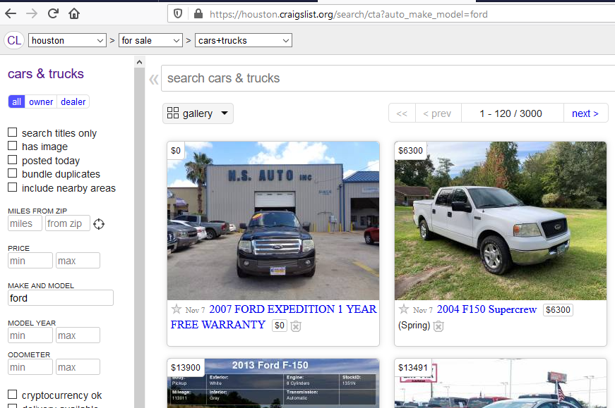

# car_price_prediction
**CraigsList vehicle price prediction with scikit-learn and tensorflow 2.0 libraries**

### We are going to scrape auto features from CraigsList to predict prices.

### <ins>Resources</ins>
* **[Notebooks](https://github.com/ageron/handson-ml2) for new <ins>[Hands-on Machine Learning with Scikit-Learn, Keras and TensorFlow 2](https://www.amazon.com/dp/1492032646/ref=cm_sw_r_tw_dp_U_x_HWDQDb0DEX69X)</ins>**
* **[TensorFlow Tutorials](https://www.tensorflow.org/tutorials/)**
* **[TensorFlow Serving with Docker](https://www.tensorflow.org/tfx/serving/docker)**
  

---
### <ins>ford_vehicle.json</ins>
* start_urls = [https://houston.craigslist.org/search/cta?auto_make_model=ford](https://houston.craigslist.org/search/cta?auto_make_model=ford)
* contains vehicle url, title, price, subLocation (Ex. Katy), attribute dictionary, and image dictionary
***
  
### start_url screenshot:

  

---
### Week 1 Notes
*Notes October 24 - October 30*

Car Price Prediction using Machine  Learning Techniques (Feb19) - ensemble provides much better predictions
* http://www.temjournal.com/content/81/TEMJournalFebruary2019_113_118.pdf

Build, Develop and Deploy a Machine Learning Model to predict cars price using Gradient Boosting (Mar19)
* https://towardsdatascience.com/build-develop-and-deploy-a-machine-learning-model-to-predict-cars-price-using-gradient-boosting-2d4d78fddf09
* https://github.com/PaacMaan/cars-price-predictor/blob/master/cars_price_predictor.ipynb

How to Build, Develop and Deploy a Machine Learning Model to predict cars price using Neural Networks (May19)
* https://medium.com/thelaunchpad/how-to-build-develop-and-deploy-a-machine-learning-model-to-predict-cars-price-using-neural-7f7439a37300

Scrapy spider tutorials:
* https://youtu.be/gGnGnIPgR84
  

---
### Week 2 Notes - Draft
*Notes October 31 - November 6*

**Scrape car price data from [Craigslist Houston cars+trucks](https://houston.craigslist.org/d/cars-trucks/search/cta)**
* Get 50+ observations per model trim
* Organize the raw features in a database
* Clean the features so they are ready for modeling

**Scrape Filter Details**
* Filtered for dealer ('ctd') or owner ('cto') and make_model='honda'
* start_urls = ['https://houston.craigslist.org/search/cta?auto_make_model=ford']

---
### Week 3 Notes - Draft
*Notes November 7 - November 13*

* Changed data parsing tehnique from regex to string splitting
* Added LightGBM model
* Added numeric poly features and category pair features
* Brainstorming effecive ways to remove outliers.  Some promising techniques are here:  [5 Detection Techniques](https://towardsdatascience.com/5-ways-to-detect-outliers-that-every-data-scientist-should-know-python-code-70a54335a623)
* Trim spelling fix, None fix, and NaN fix was counterintuitive.  Fixing NaN only produced the best result!
* **Certain prices are actually down payments.  Usually $1,000 or less and "down" may be in the listing.**

### Week 4 Notes - Draft
*Notes November 14 - November 20*
* Wrote script to download images for 7,300 vehicle listings.
* Built residuals visualization with bounds marking 3 standard deviations
* Improved invalid price identification by mining text for money "Down".
* Added VIN feature which revealed a large number of duplicates!  This caused data leakage because duplicates may fall in both train and test. Autos with matching Title/Odometer/Price we also flagged as duplicates.
* Data leakage in test **overstated** prediction performance because certain vehicles in train and test were the same vehicles (same features and price).  The unique listing, called vehicleID, was different.  However, the VIN for certain vehicles, was in many listings.

### Week 5 Notes - Draft
*Notes November 21 - November 27*
* Rebuilt Make/Model/Trim pipeline to better use regular expressions.
* At the moment, using trims "as-is" works better than harmonizing spellings.  Need to investigate further.

